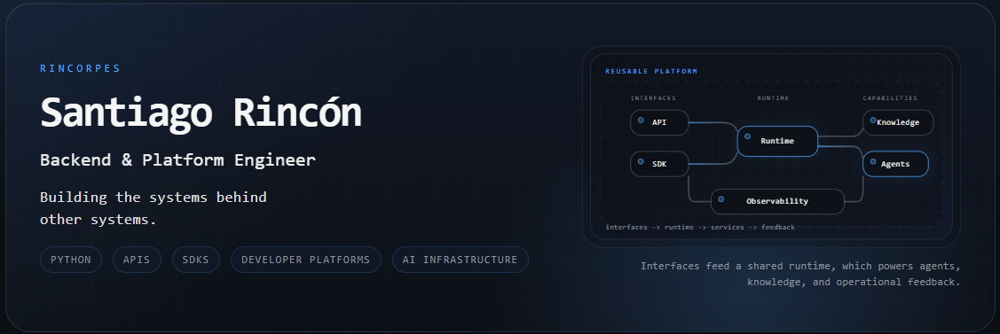

# Hi, I'm Santiago Rincón 👋

<p align="center">

</p>
<p align="center">
<a href="https://linkedin.com/in/rincorpes"> </a>
<a href="https://dev.to/rincorpes"> </a>
</p>

------------------------------------------------------------------------

## 👋 About me

I'm a **Backend & Platform Engineer** with **6+ years of professional
experience** building Python services, APIs, internal SDKs, automation
systems, developer platforms, and AI-powered tooling.

I've designed reusable software used by engineering teams across
**healthcare, creative production, and business operations**, often
leading initiatives from architecture through implementation.

My work focuses on turning recurring engineering problems into
maintainable systems that improve:

-   developer experience
-   reliability and observability
-   software reuse
-   product delivery

> **I build the systems behind other systems.**

## ⚙️ What I build

<table>
<tr>
<td width="33%" valign="top">
  
### 🔌 Backend Systems

Python services, APIs, integrations, asynchronous workflows, WebSockets,
and data-driven applications.

</td>
<td width="33%" valign="top">
  
### 🧰 Developer Platforms

Internal SDKs, shared libraries, CLIs, automation, observability, and
tooling that helps engineering teams move faster.

</td>
<td width="33%" valign="top">

### 🧠 AI Infrastructure

Agent runtimes, structured knowledge, tool integration, evaluation
pipelines, and production-oriented AI systems.

</td>
</tr>
</table>

## 🌌 Featured Work

### Endr

> An AI-native Minecraft platform used to explore knowledge systems,
> agent runtimes, developer tooling, and autonomous software.

``` text
Minecraft
    │
    ▼
Runtime ──────── Agents
    │               │
    ▼               ▼
Clients         Knowledge Platform
                    │
          ┌─────────┼─────────┐
          ▼         ▼         ▼
         API       SDKs      ETL
```

Current areas of development:

-   Version-aware Knowledge Platform
-   FastAPI Knowledge API
-   Python & JavaScript SDKs
-   ETL Pipeline
-   Runtime
-   AI Agents

## 🧪 Other Projects

Project | Description |
|:-------:|:-------:|
| **Paradox** | A lightweight JavaScript UI toolkit focused on reusable components, simple abstractions, and developer experience. |
| **Mini Arcade** | A collection of reusable engines, systems, and experiments for browser-based games.

## 🧰 Core Stack

**Languages**

Python • JavaScript • TypeScript • Node.js • SQL

**Frameworks**

FastAPI • Django • WebSockets

**Infrastructure**

Docker • GitHub Actions • PostgreSQL • MySQL • MongoDB

``` python
engineering_focus = {
    "backend": [
        "API design",
        "service architecture",
        "integrations",
        "async systems",
    ],
    "platform": [
        "SDKs",
        "developer tooling",
        "automation",
        "observability",
    ],
    "ai": [
        "agent infrastructure",
        "knowledge systems",
        "tool orchestration",
    ],
}
```

## 🧭 Engineering Principles

``` text
Build for reuse.
Design clear boundaries.
Make systems observable.
Optimize for maintainers.
Improve the developer experience.
```

## ✍️ Writing & Building in Public

I write about:

-   Backend Engineering

-   Platform Engineering

-   API & SDK Design

-   AI Infrastructure

-   Knowledge Systems

-   ETL Pipelines

-   Software Architecture

-   💼 LinkedIn: https://linkedin.com/in/rincorpes

-   ✍️ DEV: https://dev.to/rincorpes

<p align="center">
<strong>Backend Engineering · Platform Engineering · Developer
Infrastructure</strong>
</p>
